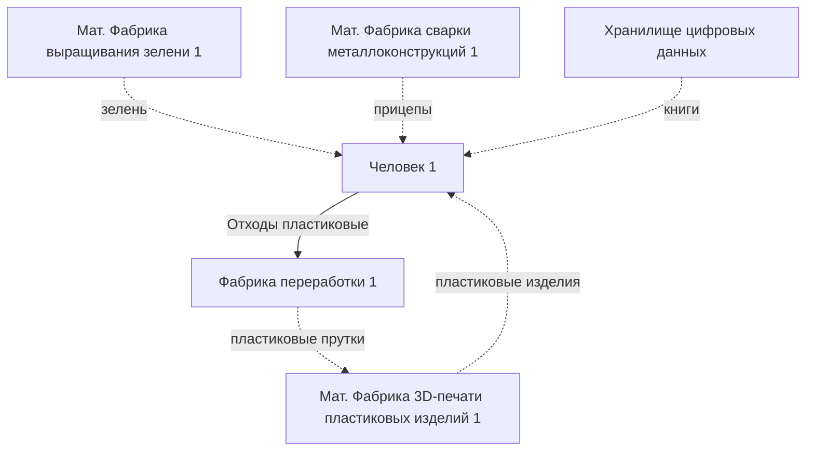

# Существующий базис модели РОЭ

## Пояснения к схеме

Стрелки:
- сплошная - ресурс отправляется адресату в момент переполнения хранилища у отправителя
- пунктирная - ресурс отправляется по запросу адресата

Источники ресурсов:
- *мат. фабрика* - фабрика, производящая материальные товары
- *ц. фабрика* - фабрика, производящая цифровые товары, которые генерируются "на лету". Например 3D-модели, музыка, графика, тексты. Полученные файлы отправляются в хранилище.
- *хранилище цифровых данных* - облачное хранилище

## Схематическое представление

