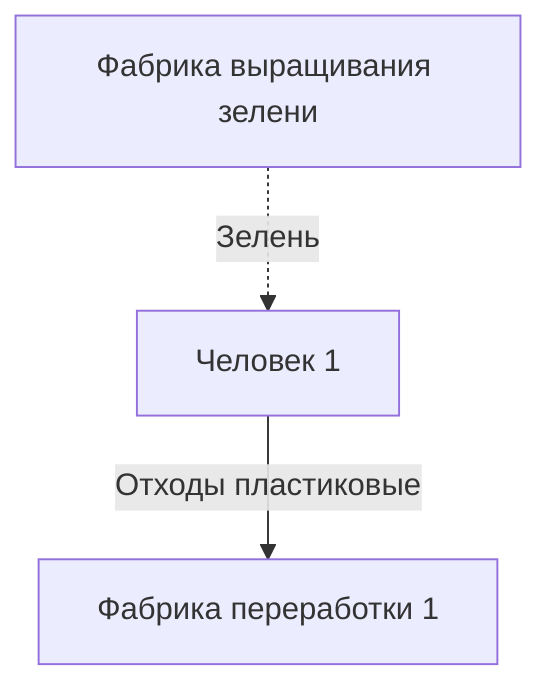

Не указаны:
- социальные отношения между людьми
- разные права касательно фабрик

Стрелки:
- сплошная - ресурс отправляется адресату в момент переполнения хранилища у отправителя
- пунктирная - ресурс отправляется по запросу адресата

