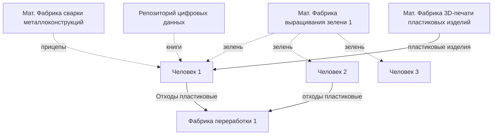

Не указаны:
- социальные отношения между людьми
- разные права касательно фабрик

Стрелки:
- сплошная - ресурс отправляется адресату в момент переполнения хранилища у отправителя
- пунктирная - ресурс отправляется по запросу адресата

Источники ресурсов:
- *мат. фабрика* - фабрика, производящая материальные товары
- *ц. фабрика* - фабрика, производящая цифровые товары, которые генерируются автоматически. Например 3D-модели, музыка, графика, тексты
- *репозиторий цифровых данных* - облачное хранилище

