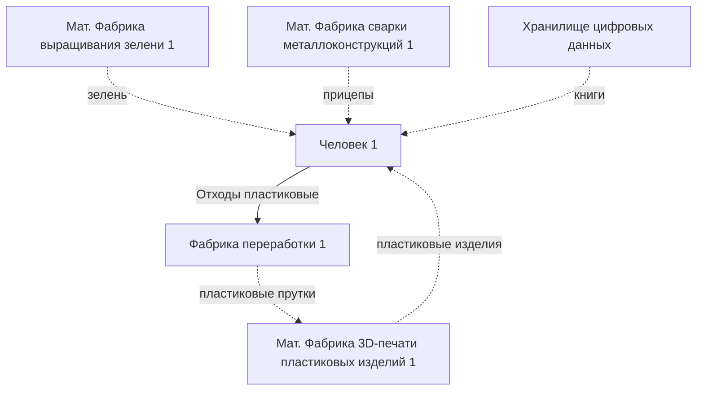

# Существующий базис модели РОЭ

## План реализации в существующих реалиях

1. Выявить все существующие экономические связи
2. Выявить потребности людей-участников
3. Составление плана производства с учётом пункта 2 
4. Учёт системой внеплановых (спонтанных) потребностей: эмоциональные приобретения или при форс-мажорных обстоятельствах
5. Учёт системой максимального объёма хранилищ, автоматический подсчёт товаров в наличии
6. Автоматический пересчёт плана при автоматическом выявлении форс-мажорных ситуаций (как глобальные катастрофы, так и необходимость в скорой мед. помощи конкретному человеку)

## Пояснения к схеме

Стрелки:
- сплошная - ресурс отправляется адресату в момент переполнения хранилища у отправителя
- пунктирная - ресурс отправляется по запросу адресата

Источники ресурсов:
- *мат. фабрика* - фабрика, производящая материальные товары
- *ц. фабрика* - фабрика, производящая цифровые товары, которые генерируются "на лету". Например 3D-модели, музыка, графика, тексты. Полученные файлы отправляются в хранилище.
- *хранилище цифровых данных* - облачное хранилище

## Схематическое представление

## Источники

1. [Базис](https://ru.wikipedia.org/wiki/%D0%98%D1%81%D1%82%D0%BE%D1%80%D0%B8%D1%87%D0%B5%D1%81%D0%BA%D0%B8%D0%B9_%D0%BC%D0%B0%D1%82%D0%B5%D1%80%D0%B8%D0%B0%D0%BB%D0%B8%D0%B7%D0%BC#%D0%91%D0%B0%D0%B7%D0%B8%D1%81), [Надстройка](https://ru.wikipedia.org/wiki/%D0%98%D1%81%D1%82%D0%BE%D1%80%D0%B8%D1%87%D0%B5%D1%81%D0%BA%D0%B8%D0%B9_%D0%BC%D0%B0%D1%82%D0%B5%D1%80%D0%B8%D0%B0%D0%BB%D0%B8%D0%B7%D0%BC#%D0%9D%D0%B0%D0%B4%D1%81%D1%82%D1%80%D0%BE%D0%B9%D0%BA%D0%B0)
2. История пошаговой реализации ОГАС в СССР:  https://www.youtube.com/watch?v=MtgXRgHJoTM
